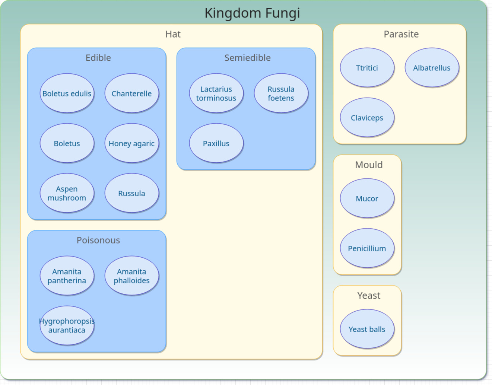

## Description
Translator is the small "diagram as code" service. It converts json-data to draw.io diagram format.
It generates a geometry layout and presents data elements as geometry figures. 
If the data has a hierarchy, then geometry elements have hierarchical nesting too.       

## Install and start
> npm install

> npm start

## Use service example
> curl -X POST --data-binary @data/mushrooms-en.json -H "Content-type: text/x-yaml" http://localhost:5000/diagram

## Result

Translator gets the input data and settings json file like this:

```
{
"elements": 
  [
   {
      "kind": "Kingdom",
      "name": "Kingdom Fungi",
      "id": "Kingdom", // unique ID
      "idParent": null
   },
   {
      "kind": "SubKingdom",
      "name": "Hat",
      "id": "Hat",
      "idParent": "Kingdom"
   },
   {
      "kind": "SubKingdom",
      "name": "Parasite",
      "id": "Parasite",
      "idParent": "Kingdom"
    },
    {
      "kind": "SubKingdom",
      "name": "Mould",
      "id": "Mould",
      "idParent": "Kingdom"
    },
    ...
  ]
"settings": {
  "diagram_layout": {
    "nested": "square"
  },
  "geometry": {
    "SubKingdom": {
      "style": "html=1;rounded=1;strokeColor=#FAAD14;fillColor=#FFFbe6;labelPosition=center;verticalLabelPosition=middle;align=center;verticalAlign=top;spacingLeft=10;spacingTop=11;fontFamily=Tahoma;spacingLeft=10;spacingTop=5;fontColor=#595959;fontSize=25;shadow=1;whiteSpace=wrap;absoluteArcSize=1;arcSize=48;",
      "nameFormat": null,
      "top": 50,
      "paddingHeight": 60,
      "bottom": 5,
      "left": 5,
      "paddingWidth": 170,
      "right": 5,
      "marginTop": 14,
      "marginBottom": 14,
      "marginLeft": 14,
      "marginRight": 14
    },
    ...
}
```
and generates diagram like this: 



## Input data format

The input file consists of two sections: 
1) data section "elements"
2) settings section "settings"

### Data section:

Data section has 

```
{
  "kind": user type of element
  "name": element name
  "id": unique element ID
  "idParent": element's parent ID 
  "type": (optional) addition type of tree leaf element for element image
  "total": (optional)  of tree leaf element
  }
}
```

### Settings section:

// to be continued ...