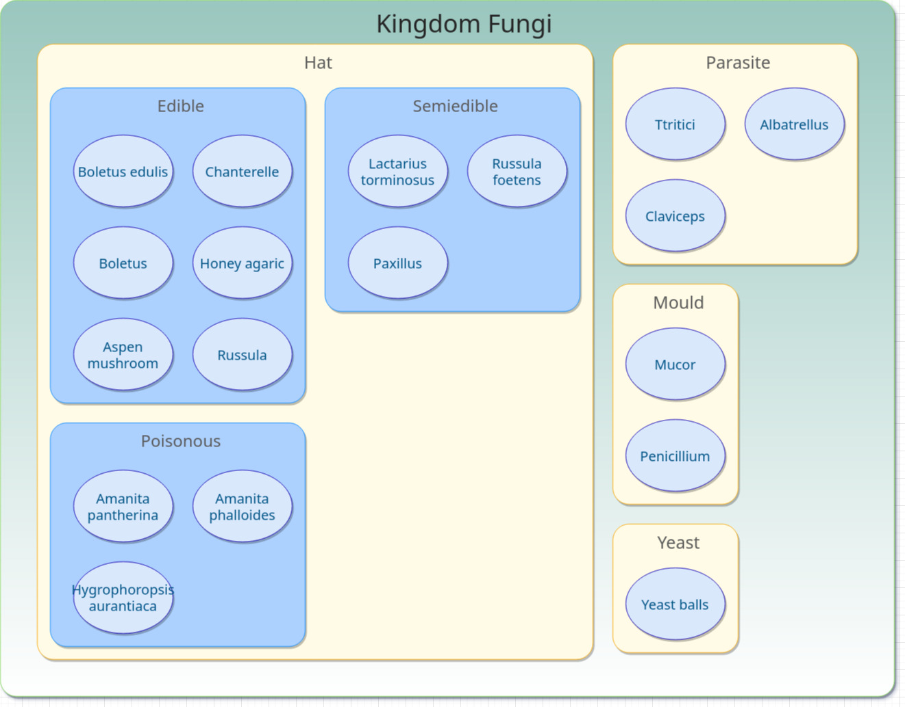
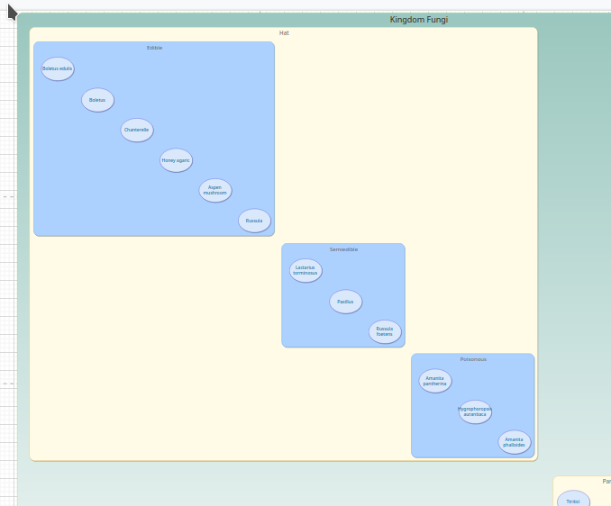
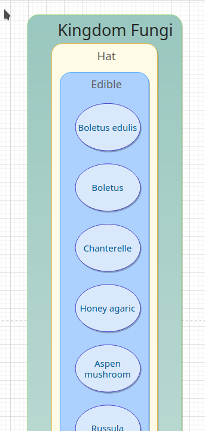
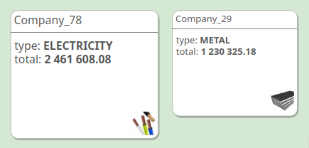
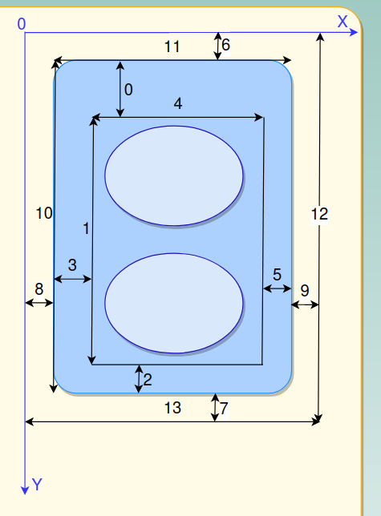

## Description
Translator is the small "diagram as code" service. It converts json-data to draw.io diagram format.
It generates a geometry layout and presents data elements as geometry figures. 
If the data has a hierarchy, then geometry elements have hierarchical nesting too.       

## Install and start
> npm install

> npm start

## Use service example
mushrooms example:
> curl -X POST --data-binary @etc/data/mushrooms-en.json -H "Content-type: text/x-yaml" http://localhost:5000/diagram

sales example:
> curl -X POST --data-binary @etc/data/sales.json -H "Content-type: text/x-yaml" http://localhost:5000/diagram

The input file has "settings" section, where you can set the value of output: 
```
 "output": "response" - receive http response 
 "output": "file"     - write result to data/diagram.xml
```

## Result

The translator receives input data and settings in json format as follows:

```
{
"elements": 
  [
   {
      "kind": "Kingdom",
      "name": "Kingdom Fungi",
      "id": "Kingdom", // unique ID
      "idParent": null
   },
   {
      "kind": "SubKingdom",
      "name": "Hat",
      "id": "Hat",
      "idParent": "Kingdom"
   },
   {
      "kind": "SubKingdom",
      "name": "Parasite",
      "id": "Parasite",
      "idParent": "Kingdom"
    },
    {
      "kind": "SubKingdom",
      "name": "Mould",
      "id": "Mould",
      "idParent": "Kingdom"
    },
    ...
  ]
"settings": {
  "diagram_layout": {
    "nested": "square"
  },
  "geometry": {
    "SubKingdom": {
      "style": "html=1;rounded=1;strokeColor=#FAAD14;fillColor=#FFFbe6;labelPosition=center;verticalLabelPosition=middle;align=center;verticalAlign=top;spacingLeft=10;spacingTop=11;fontFamily=Tahoma;spacingLeft=10;spacingTop=5;fontColor=#595959;fontSize=25;shadow=1;whiteSpace=wrap;absoluteArcSize=1;arcSize=48;",
      "nameFormat": null,
      "top": 50,
      "paddingHeight": 60,
      "bottom": 5,
      "left": 5,
      "paddingWidth": 170,
      "right": 5,
      "marginTop": 14,
      "marginBottom": 14,
      "marginLeft": 14,
      "marginRight": 14
    },
    ...
}
```
and generates diagram like this: 



## Input data format

The input file consists of two sections: 
1) data section "elements"
2) settings section "settings"

### Data section:

Data section has 

```
{
  "kind": user type of element
  "name": element name
  "id": unique element ID
  "idParent": element's parent ID 
  "type": (optional) addition type of tree leaf element for element image
  "total": (optional)  of tree leaf element
  }
}
```

### Settings section:

Data section has 

```
  "settings": {
    "diagram_layout": { 
        the type of diagram ["nested"]: 
        the type of diagram layout - the one of ["diagonal",
                                                 "list",
                                                 "centerList",
                                                 "stupidSquare",
                                                 "square"
                                                ]},
```
  the example of diagonal layout:
  


  the example of centerList layout:



```
    "log_warnings": to allow log output
    "scale": 10,
    "use_quick_intersect_detection": to allow quick draw algorithm, use only for the correctly oriented rectangles
    "speed": natural number of quality placement figures in the free space (1 - high quality, low speed)
    "type_field_name": the name of json data field key, which defines type of object, 
                       the value of this data field could be key of "image" settings section below.
    "size_field_name": the name of json data field key, which defines size value.
    "scale": scaling coefficient
    "geometry": {
         <name of kind>: {
           "style": css style of figure,
           "nameFormat": {
             "properties": {
               "1": the first name field, value will be put out
               "2": the second name field, value will be put out
             }
           },

       for example, data/sales.json has objects in data secton:
        {
          "kind": "Supplier",
          "name": "Company_78",
          "id": "Mary@Company_60@Company_78",
          "idParent": "Mary@Company_60",
          "type": "ELECTRICITY",
          "total": 2461608.08
        },
        {
          "kind": "Supplier",
          "name": "Company_29",
          "id": "Mary@Company_60@Company_29",
          "idParent": "Mary@Company_60",
          "type": "METAL",
          "total": 1230325.18
        },
        and has settings:
           "type_field_name": "type",
           "size_field_name": "total",
           "image": {
             "METAL": {
                "url": "image=https://<metal>.jpg;imageWidth=48;imageHeight=48;"
              },
             "ELECTRICITY": {
                "url": "image=https://<electricity>.jpg;imageWidth=48;imageHeight=48;"
              },
           "geometry": {
             <name of kind>: {
               "style": css style of figure,
               "nameFormat": {
                 "properties": {
                   "1": "type",
                   "2": "total"
                 }
               },

```
 the result will be:
   


besides it, section "geometry" set minimal default size (px) of objects:  
```
    "geometry": {
        "top": number (0),
        "paddingHeight": number (1),
        "bottom": number (2),
        "left": number (3),
        "paddingWidth": number (4),
        "right": number (5),
        "marginTop": number (6),
        "marginBottom": number (7),
        "marginLeft": number (8),
        "marginRight": number (9)
      },
  
    10 - object visible height  
    11 - object visible width
    12 - object margin height
    13 - object margin width
 ```
 

